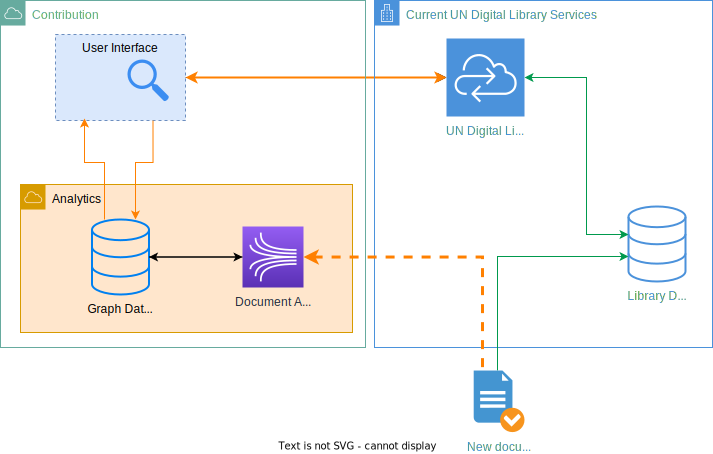

# 🇺🇳 United Nations Searchable Graph UI

Now represents UNBIS Thesaurus, but soon to be expanded to UN Digital Library documents

## Stack

- React
- TypeScript
- `@react-sigma`
- `sigma.js`

## Infrastructure of the project

## Useful links:

- [UNBIS Thesaurus](https://metadata.un.org/thesaurus/?lang=en)
- [`un-unbis-thesaurus-scraper`](https://github.com/ClementSicard/un-unbis-thesaurus-scraper)
- [`sigma.js` Repo](https://github.com/jacomyal/sigma.js)
- [`SigmaContainer` settings](https://github.com/jacomyal/sigma.js/blob/main/src/settings.ts)
- [`@react-sigma` documentation](https://sim51.github.io/react-sigma/docs/api/core)
- [`React-Rooter` tutorial](https://reactrouter.com/en/main/start/tutorial)
